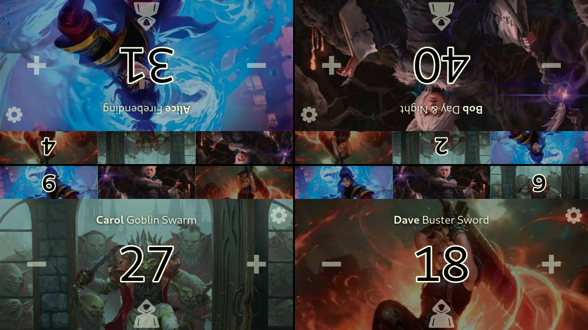

# Life Trinket - Free MTG Life Counter & Commander Damage Tracker

[](https://life-trinket.web.app/)
[](LICENSE)
[](https://reactjs.org/)
[](https://www.typescriptlang.org/)



> **Fork notice:** This is a fork of [Vikeo/LifeTrinket](https://github.com/Vikeo/LifeTrinket).
> It is deployed on **Cloudflare Pages** instead of Firebase Hosting, and ships
> with no third-party analytics. See the original project for the canonical
> hosted app at [life-trinket.web.app](https://life-trinket.web.app/).

A **free, offline-capable PWA life counter** for **Magic: The Gathering** built with **React 19** and **TypeScript**. Perfect for **Commander/EDH** games with comprehensive tracking for life totals, commander damage, poison counters, energy, and experience. **Share game states instantly via QR code** with other players.

## Why Life Trinket?

Created for the Commander/EDH community because existing life counters lacked essential features for multiplayer Magic games. Life Trinket is a **lightweight, privacy-focused web app** that does what you need without bloat.

✅ **No accounts required**
✅ **No advertisements**
✅ **No analytics or tracking** (this fork ships without an analytics provider)
✅ **100% free and open source**
✅ **Works completely offline** after PWA installation

## 📋 Usage

There are some controls that you might now know about, so here's a short list of them.

### Life counter

- **Tap** on a player's + or - button to add or subtract **1 life**.
- **Long press** on a player's + or - button to add or subtract **10 life**.

### Commander damage and other counters

- **Tap** on the counter to add **1 counter**.
- **Long press** on the counter to subtract **1 counter**.

### Other

- When a player is **at or below 0 life**, has taken **21 or more Commander Damage** or has **10 or
  more poison counters**, a button with a skull will appear on that player's card.

  Tap on the button to mark that player as lost, dimming their player card.

## 🚀 Features

### General features

- 🌐 Web app, no installation required
  - (Though you can and probably should install it as a PWA (Progressive Web App) via your
    mobile browser)
- 📴 Works offline
  - (If you have installed it as a PWA)
- 🆓 Free
- ❌ No ads
  - There is a "Feed this guy" button if you want to support me
- 🚫 No analytics or tracking
- 📲 Share game state via QR code
  - Share your current game with other players instantly
  - Scan QR code to load the exact game state on another device

### Life counter features

- 🔢 Life counter for up to 6 players
- 💥 Different types of damage tracking
  - 👑 Commander damage
  - 👫 Partner damage
  - ☠️ Poison
- 📊 Other counters
  - ✨ Experience
  - ⚡ Energy
- 🎨 Full RGB color picker for each player
  - Depends on browser support (Chrome and Safari works at least)

## ⚠️ Known issues

- It is not possible to change player colors in Firefox mobile browsers.

## 🛠️ Tech Stack

- **Frontend Framework**: React 19.2.0 with functional components and hooks
- **Language**: TypeScript 5.9 in strict mode
- **Styling**: Tailwind CSS v4 with react-twc for typed components
- **Build Tool**: Vite with SWC for fast compilation
- **PWA**: vite-plugin-pwa with Workbox for offline functionality
- **Validation**: Zod for runtime schema validation
- **Analytics**: None
- **Hosting**: Cloudflare Pages (static build + `public/_headers` / `public/_redirects`)
- **State Management**: React Context API
- **Persistence**: LocalStorage with validation

## 📱 Installation

### As a Progressive Web App (Recommended)

**iOS (Safari)**:
1. Open [life-trinket.web.app](https://life-trinket.web.app/) in Safari
2. Tap the Share button
3. Scroll down and tap "Add to Home Screen"
4. Tap "Add"

**Android (Chrome)**:
1. Open [life-trinket.web.app](https://life-trinket.web.app/) in Chrome
2. Tap the menu (three dots)
3. Tap "Install app" or "Add to Home Screen"

### For Development

```bash
# Clone the repository
git clone https://github.com/pheonton/LifeTrinket.git
cd LifeTrinket

# Install dependencies (requires pnpm)
pnpm install

# Start development server
pnpm run dev

# Build for production
pnpm run build

# Preview production build
pnpm run preview
```

### Deployment (Cloudflare Pages)

This fork deploys as a static site on **Cloudflare Pages** via its GitHub
integration — no secrets or deploy workflow required:

1. In the Cloudflare dashboard: **Workers & Pages → Create → Pages → Connect to Git**
2. Select this repository
3. Build settings:
   - Framework preset: **Vite**
   - Build command: `pnpm run build`
   - Build output directory: `dist`
4. Save. Every push to `main` deploys to production; other branches and PRs get
   preview URLs.

`public/_headers` sets security and cache headers; `public/_redirects` provides
the SPA fallback so any path serves `index.html`. Both files also work as-is on
Netlify if you prefer it.

## 🤝 Contributing

This is a personal fork. For contributions to the upstream project, see
[Vikeo/LifeTrinket](https://github.com/Vikeo/LifeTrinket/issues).

## 📄 License

This project is licensed under the [GNU Affero General Public License v3.0](LICENSE).
Because the AGPL's network-use clause applies, any publicly hosted modified
version must make its complete source available to users — this repository being
public satisfies that.

## 🙏 Acknowledgments

- Magic: The Gathering players and the Commander/EDH community
- React, Vite, and Tailwind CSS teams for excellent tools
- All contributors and users who provide feedback

## 🔍 Keywords

MTG life counter, Magic the Gathering life tracker, Commander life counter, EDH life counter, MTG commander damage tracker, Magic life counter app, MTG poison counter, MTG energy counter, multiplayer life counter, free MTG app, offline MTG counter, PWA life counter, Magic gathering app, commander damage calculator, MTG game tracker, QR code game sharing, share MTG game state

---

Made with ❤️ for the Magic: The Gathering community by [Viktor Raadberg](https://github.com/Vikeo)
